# Week 5 Assignment

**Name:** Ronik Neupane  
**Student ID:** 12300969  

This week’s lab focuses on configuring VLANs on a switch and enabling communication between VLANs using a router.

---

## Task 1 – Setup VLANs on Switch

In this task, a network was created using four Linux hosts connected to an OpenvSwitch.  
The goal was to divide the network into separate VLANs so that certain hosts could communicate while others remain isolated.

### Network Topology

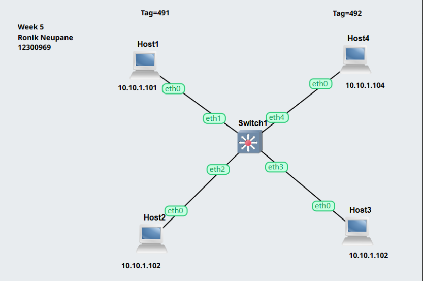

The topology shows all four hosts connected to the switch.  
Host1 and Host2 are grouped into VLAN 491, while Host3 and Host4 are placed in VLAN 492.

### VLAN Configuration

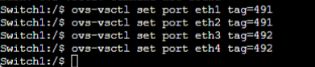

VLAN tagging was applied on the switch ports:
- Ports `eth1` and `eth2` were assigned to VLAN 491  
- Ports `eth3` and `eth4` were assigned to VLAN 492  

This configuration separates the network into two logical groups.

### Switch Initialization

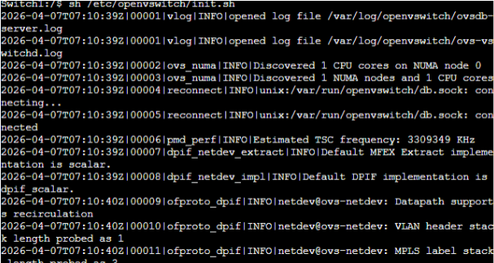

OpenvSwitch was started manually to ensure the switch services were running correctly before applying configurations.

### Verification of VLAN Setup

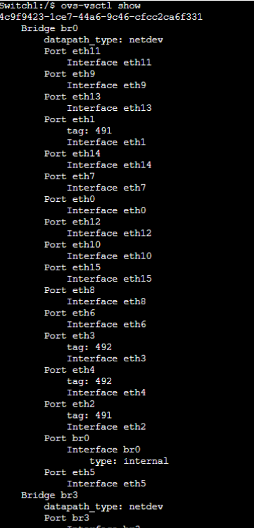

The configuration was verified using the switch output, confirming that each port was assigned to the correct VLAN.

### Ping Test – Same VLAN

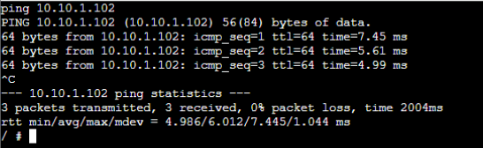

A ping test between Host1 and Host2 was successful since both devices belong to VLAN 491.

### Ping Test – Different VLAN

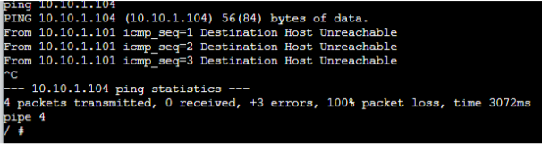

A ping test between Host1 and Host4 failed because they are in different VLANs.  
This confirms that VLAN segmentation is functioning correctly.

### ARP Table Check

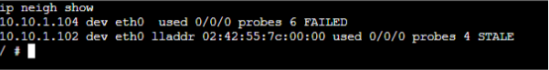

The ARP table was checked to observe how devices resolve MAC addresses within the same VLAN.

---

## Task 2 – Setup VLANs on a Router

In this task, the previous topology was extended by adding a router.  
The purpose of the router is to enable communication between VLAN 491 and VLAN 492.

### Updated Network Topology

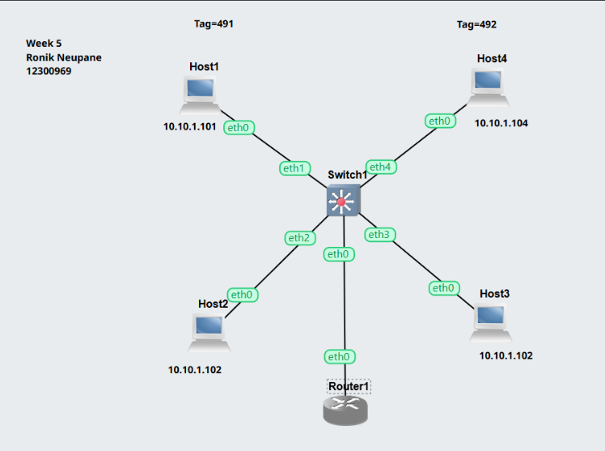

The router is connected to the switch, allowing traffic to pass between VLANs.

### Router Configuration

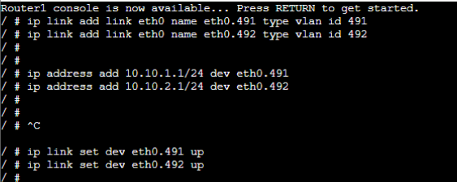

Sub-interfaces were created on the router to support VLANs:
- `eth0.491` for VLAN 491  
- `eth0.492` for VLAN 492  

Each interface was assigned an IP address:
- `10.10.1.1/24` for VLAN 491  
- `10.10.2.1/24` for VLAN 492  

This setup allows the router to act as a gateway for both networks.

### Ping Test Between VLANs

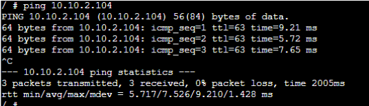

After configuring the router, communication between VLANs was successful.  
The ping between hosts in different VLANs worked, showing that inter-VLAN routing is functioning correctly.

### Capture and File Verification

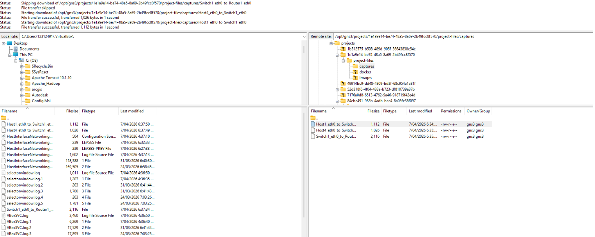

Packet captures and project files were saved to verify network activity and confirm successful configuration.

---

## Conclusion

This lab demonstrated how VLANs can be used to logically separate a network into multiple segments.  
Initially, devices in different VLANs were unable to communicate, ensuring proper isolation.  

After introducing a router and configuring VLAN sub-interfaces, communication between VLANs became possible.  
This highlights the importance of routing in multi-VLAN environments and how switches and routers work together to manage network traffic.
