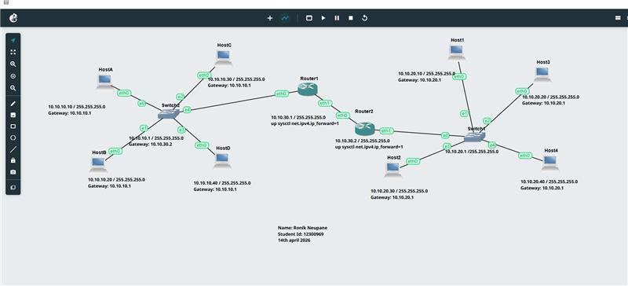
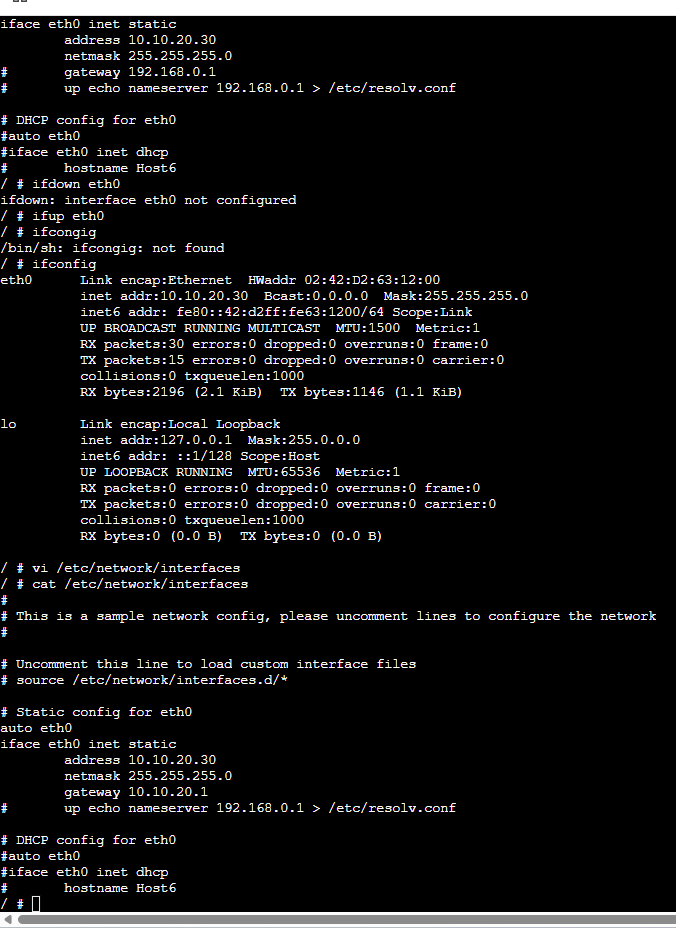
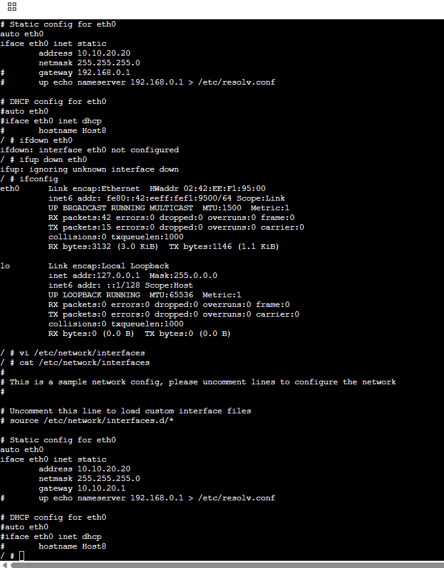

# Week 6 Assignment

**Name:** Ronik Neupane  
**Student ID:** 12300969  

---

## Network Topology

---

## Host Configuration

### Left-side hosts

### Right-side hosts

---

## Router Configuration

### Router 1

### Router 2

---

## Explanation

This network was created in GNS3 using multiple hosts and routers. Each host was configured with static IP addressing, and routers were used to connect different networks. The screenshots show the configuration of each device and the network topology.

---

## Conclusion

The Week 6 network was successfully configured. All hosts and routers were set up correctly, and the screenshots provide evidence of the completed configuration.
