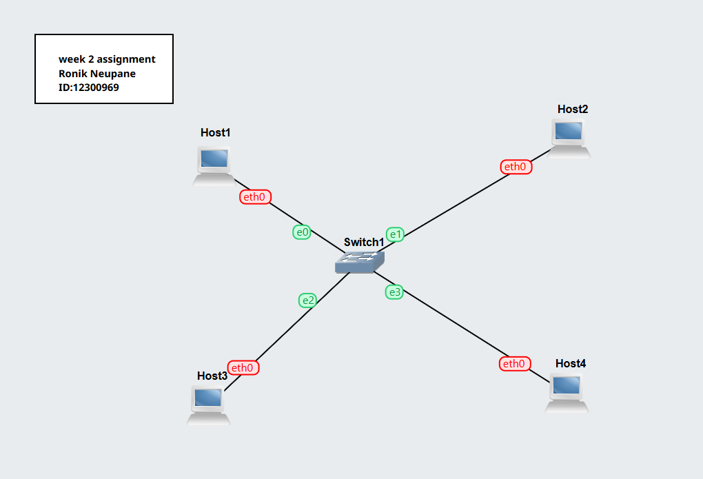
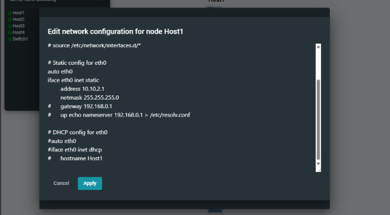
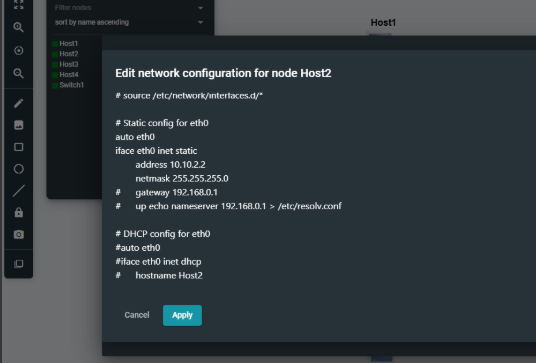
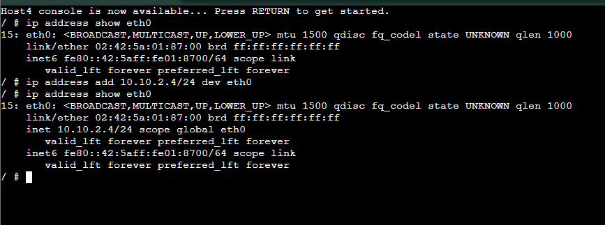
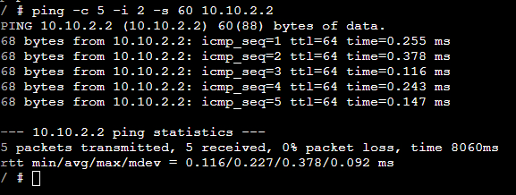

# Week 2 Assignment

**Name:** Ronik Neupane  
**Student ID:** 12300969  

## Task 1: Setting Static IP Addresses

In this task, a network was created in GNS3 using four Linux hosts and one Ethernet switch connected in a LAN topology. Each host was assigned a static IP address within the same network range (10.10.2.0/24).

Host1 and Host2 were configured using the GNS3 configuration window by editing the `/etc/network/interfaces` file before starting the nodes. This method automatically applies the IP configuration when the node starts.

Host3 was configured manually through the console by editing the `/etc/network/interfaces` file using the nano editor. After making changes, the interface was restarted using `ifdown eth0` and `ifup eth0` to apply the configuration.

Host4 was configured using the `ip address add` command, which assigns the IP address immediately but is not permanent after reboot.

The IP addresses used were:

- Host1: 10.10.2.1/24  
- Host2: 10.10.2.2/24  
- Host3: 10.10.2.3/24  
- Host4: 10.10.2.4/24  

### Network Topology

### Host1

### Host2

### Host3

### Host4

---

## Task 2: Testing Network Connectivity using Ping

In this task, the ping command was used to test connectivity between hosts and measure network delay (RTT).

A simple ping test was performed between hosts, and the output showed successful replies with 0% packet loss. This confirms that all devices are correctly connected in the network.

A second ping test was performed to a non-existent IP address (10.10.2.5). The result showed “Destination Host Unreachable” and 100% packet loss, indicating that the IP address does not exist in the network.

A third ping test was performed using options (`-c`, `-i`, and `-s`) to control the number of packets, interval, and packet size. The results confirmed successful communication and showed how these options affect the ping behavior.

### Simple Ping

### Ping Error

### Ping Options

---

## Conclusion

This lab demonstrated different methods of assigning static IP addresses on Linux hosts in GNS3 and how to verify connectivity using the ping command. The results confirmed that the network was correctly configured and all hosts were able to communicate successfully.
