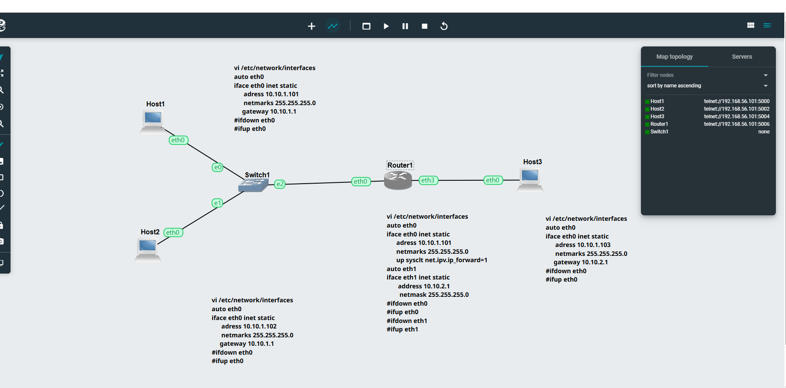
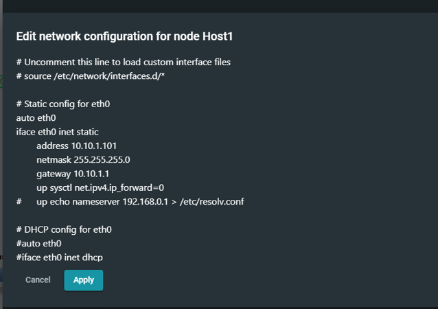
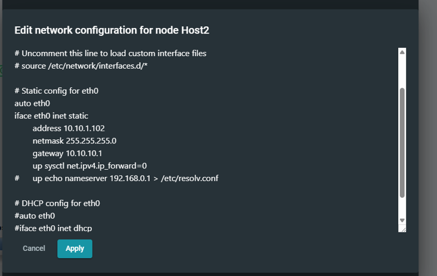
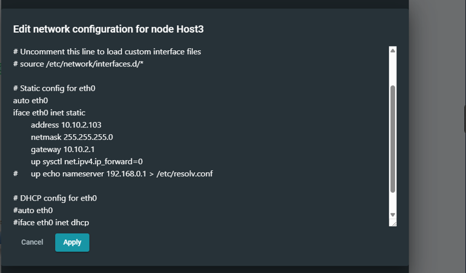
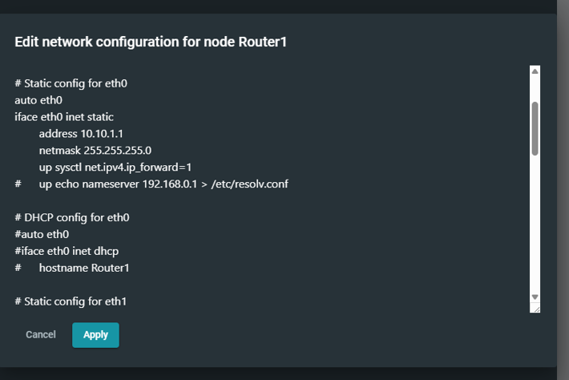
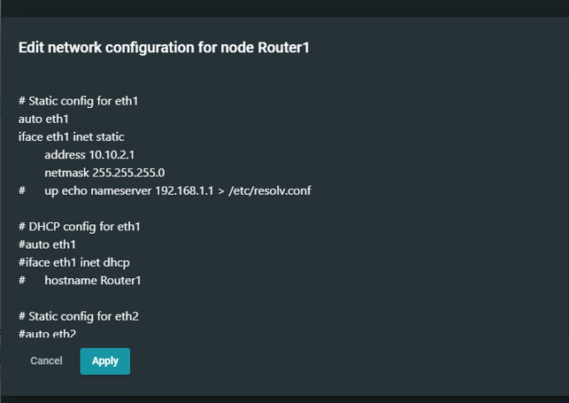
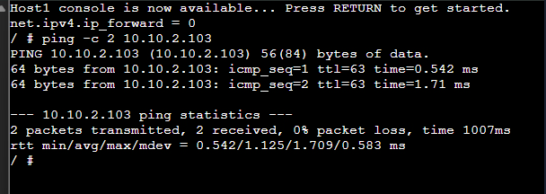
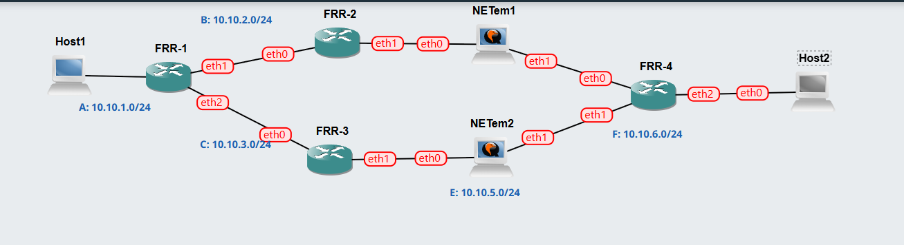
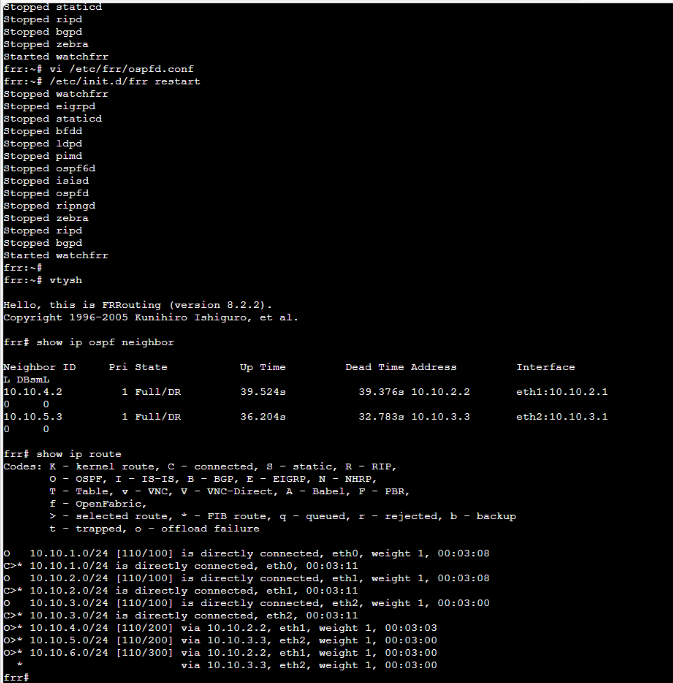
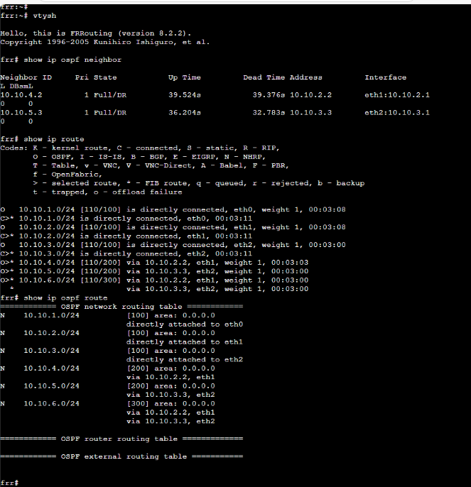

# Week 4 – Network Configuration and Routing

## Overview

In this week, I worked on two tasks.  
Task 1 was about setting up static IP addresses.  
Task 2 was about configuring OSPF routing so different networks can communicate.

---

# Task 1 – Static IP Configuration

## Topology

This diagram shows the network with three hosts connected to a switch and a router.

---

## Host Configurations

Host1 was given a static IP address and a default gateway so it can communicate with other networks.

Host2 was also configured with a static IP in the same network as Host1.

Host3 is in a different network and uses the router as its gateway to communicate.

---

## Router Configuration

This interface connects to the network where Host1 and Host2 are located.

This interface connects to the network where Host3 is located, allowing communication between both networks.

---

## Connectivity Test

Ping was used to check if the devices can communicate. The replies confirm that the connection is working.

---

## Result

All hosts were able to communicate successfully, which means the static IP setup was done correctly.

---

# Task 2 – OSPF Routing

## Topology

This diagram shows multiple routers connected together using OSPF.

---

## FRR Configuration

FRR was configured on the routers to enable OSPF routing.

---

## Routing Table

The routing table shows both directly connected networks and routes learned through OSPF.

---

## OSPF Routes

This output shows the routes that were shared between routers using OSPF.

---

## Traceroute 1

This traceroute shows the path taken by packets through the network.

---

## Traceroute 2

This traceroute also confirms that communication between networks is working properly.

---

## Result

OSPF routing worked successfully and allowed communication between different networks.
